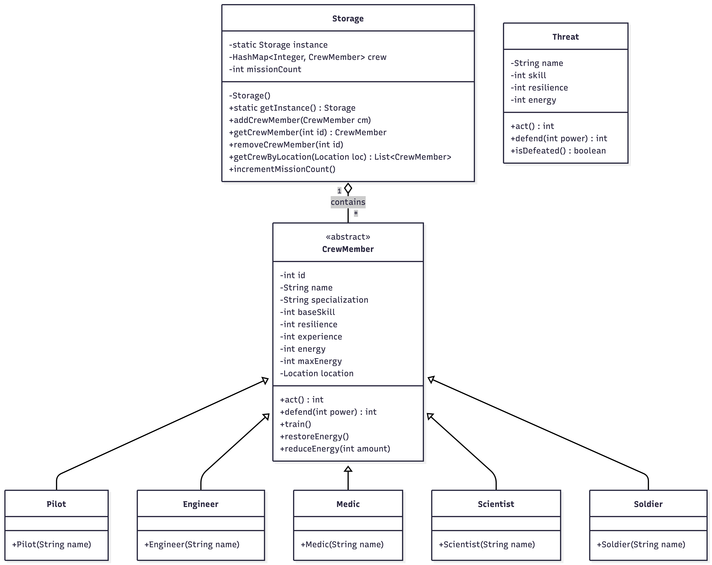

# Space Colony

## General Project Description  
Space Colony is an Android-based management and tactical combat game. The player manages a crew of space explorers with different specializations (Pilot, Engineer, Medic, Scientist, and Soldier).

### The core gameplay involves:  
Recruitment: Creating new crew members with unique starting stats.  
Management: Moving crew members between different locations (Quarters, Simulator, and Mission Control).  
Training: Spending energy in the Simulator to gain Experience Points (XP), which increases combat effectiveness. Missions: Sending pairs of crew members on turn-based, cooperative missions against scaling system-generated threats.  
Permadeath: Crew members who lose all energy during a mission are permanently removed from the colony.

## Class Diagram  

## Implemented Features  
The project implements all mandatory requirements and several bonus features:

### Core Requirements:
OOP Principles: Used Inheritance (Subclasses of CrewMember), Abstraction (CrewMember is abstract), and Encapsulation (Private fields with Getters/Setters).  
Crew Management: Recruitment system and location-based management (Quarters/Simulator/Mission Control).  
Training System: Gain XP in Simulator with an associated energy cost.  
Cooperative Mission System: Scaling difficulty, turn-based logic, and combat logs.  
Crew Recovery: Energy restoration when returning to Quarters.  

### Bonus Features:
RecyclerView: Used for efficient list display in all management screens.  
Unique Visuals: Custom icons and color-coded themes for each specialization.  
Scaling Difficulty: Threats grow stronger as the number of completed missions increases.  
Energy Cost in Simulator: Training consumes energy, creating a meaningful resource loop.  
